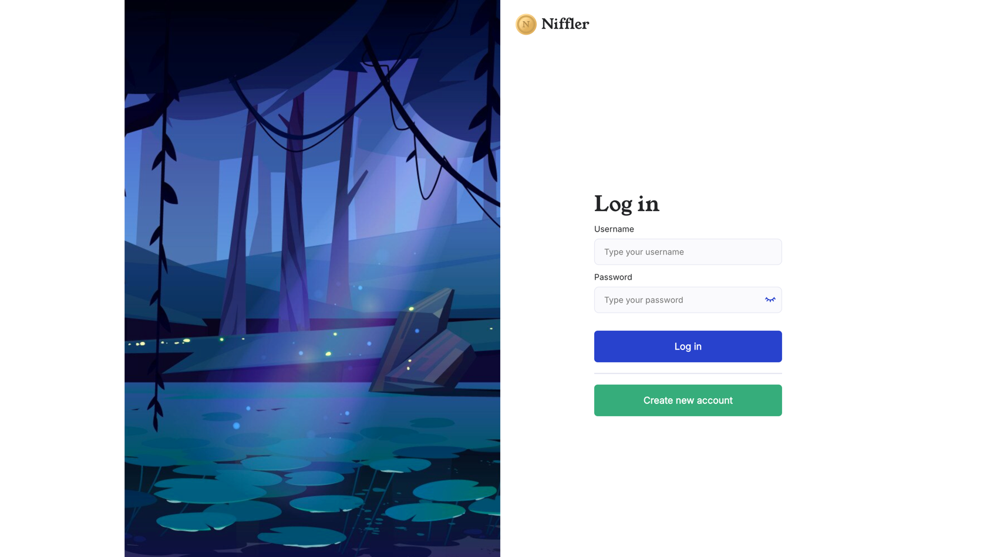
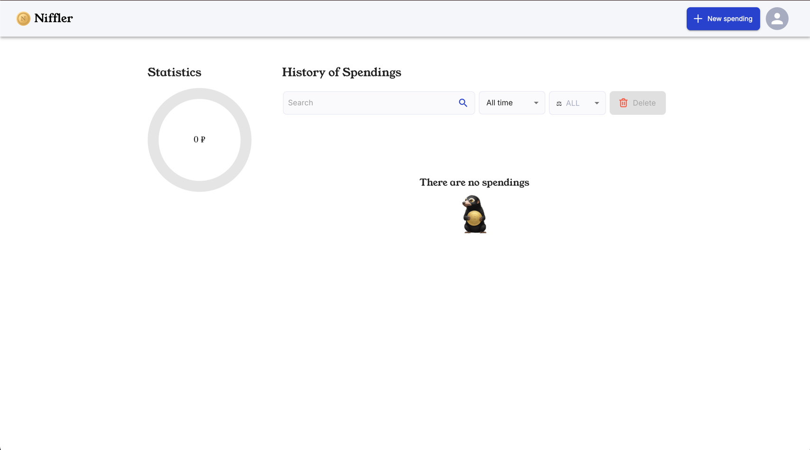
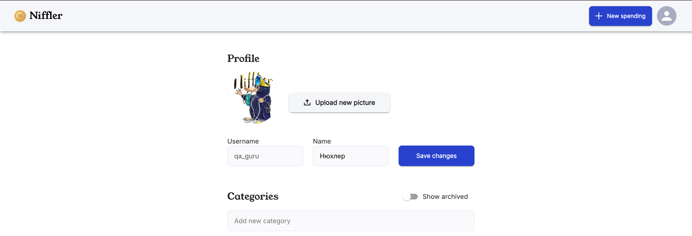
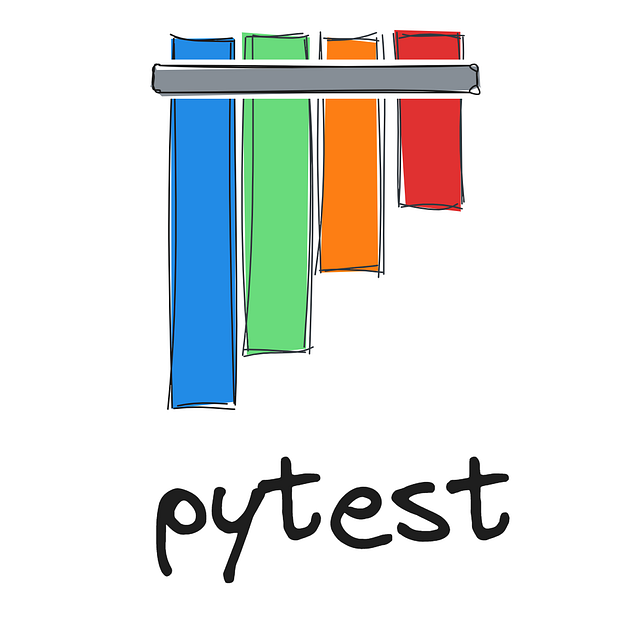

## Проект автоматизированного тестирования приложения Niffler.
### Скриншоты страниц (обьекта тестирования) 
#### Страница авторизации
<p align="center">
  
</p>

#### Главная страница
<p align="center">
  
</p>

#### Страница профиля
<p align="center">
  
</p>

---
### Проект Создан в рамках курса по [автоматизации тестирования](https://qa.guru/python_advanced)

---

### 💡 О проекте: 
#### Проект реализует автоматизированные тесты для проекта [Niffler](https://github.com/qa-guru/niffler-py-st1) с использованием современных инструментов и технологий автоматизации:
<table>
  <tr>
    <td align="center">
      <br>
      <b>Python</b>
    </td>
    <td align="center">
      <br>
      <b>Pytest</b>
    </td>
    <td align="center">
      <br>
      <b>Playwright</b>
    </td>
    <td align="center">
      <br>
      <b>Requests</b>
    </td>
    <td align="center">
      <br>
      <b>Allure</b>
    </td>
    <td align="center">
      <br>
      <b>gRPC (plan)</b>
    </td>
  </tr>
  <tr>
    <td align="center">
      <br>
      <b>Kafka</b>
    </td>
    <td align="center">
      <br>
      <b>SOAP</b>
    </td>
    <td align="center">
      <br>
      <b>GraphQL (plan)</b>
    </td>
    <td align="center">
      <br>
      <b>Postgres</b>
    </td>
    <td align="center">
      <br>
      <b>Docker</b>
    </td>
    <td align="center">
      <br>
      <b>GitHub Actions</b>
    </td>
  </tr>
</table>

---


### 🎯 Цель проекта:

- Проверка корректной работы пользовательского интерфейса (UI).
- Автоматизация тестирования интеграций с внешними сервисами (Kafka, SOAP, Database).
- Генерация удобных отчетов в Allure и поддержка CI/CD через GitHub Actions.

---

## 📁 Структура проекта
```text
project/
├── clients/                 # Клиенты для подключения к внешним сервисам (REST API, gRPC, Kafka, SOAP)
├── config/                  # Конфигурации для моков и окружений (pydantic Settings)
├── databases/               # Скрипты и подключения к базам данных
├── fixtures/                # Подготовка тестовых данных
├── grpc_proto/              # gRPC proto и сгенерированные файлы
│   ├── grpc/
│   │   └── interceptors/    # gRPC interceptors
│   ├── internal/
│   │   └── pb/              # Сгенерированные protobuf файлы
│   └── protos/
│       ├── google/
│       │   └── protobuf/    # Стандартные proto файлы Google
│       └── grpc/
│           ├── health/
│           │   └── v1/      # Health proto
│           └── reflection/
│               └── v1alpha/ # Reflection proto
├── images/                  # Статические изображения для тестов
│   └── icons/               # Иконки и мелкие графические файлы
├── models/                  # Python модели данных (DTO)
├── pages/                   # Page Object для UI тестов
├── resources/               # Статические файлы для тестов и отчётов
│   └── templates/           # Allure шаблоны для раскраски запросов и ответов
├── templates/               # Шаблоны для XML/XSD
│   ├── xml/
│   └── xsd/
├── tests/                   # Тесты
│   ├── api/                 # Тесты REST API
│   ├── grpc/                # Тесты gRPC
│   ├── kafka/               # Тесты Kafka
│   ├── soap/                # Тесты SOAP
│   └── ui/                  # UI тесты
└── utils/                   # Вспомогательные функции и библиотеки
```

#  🛠 Подготовка к Локальному запуску тестов (Mac OS)

❗ Для корректного запуска требуется Java 21
установить Java 21 для текущего терминала

```bash
export JAVA_HOME=$(/usr/libexec/java_home -v 21)
export PATH=$JAVA_HOME/bin:$PATH
```

1️⃣ Клонируем репозиторий:
```bash
git clone https://github.com/your/project.git
```
2️⃣ Переходим в директорию проекта:
```bash
cd niffler-py-st3-1
```
3️⃣ Запускаем контейнеры
```bash 
./docker-compose-dev.sh
```
### ✅ После успешного запуска контейнеров можно переходить к установке зависимостей.

4️⃣ Переходим в папку с тестами 
```bash
cd niffler-e-2-e-tests
```
5️⃣ Устанавливаем зависимости через Poetry
```bash 
poetry install
```
6️⃣ Устанавливаем браузеры для Playwright
```bash
poetry run playwright install
```

### ✅ После выполнения всех шагов проект готов к запуску тестов.

---

## ▶️ Запуск тестов

Проект поддерживает как последовательный, так и параллельный запуск тестов с генерацией отчета Allure.

#### Последовательный запуск тестов

```bash
poetry run pytest --alluredir=allure-results --clean-alluredir
```
#### Параллельный в 2 потока:
```bash
poetry run pytest -n 2 --dist loadgroup --alluredir=allure-results --clean-alluredir
```
### Генерация просмотр Allure отчета
```bash
allure serve allure-results
```

## ⚡ Тестирование с mock gRPC-сервером валют

Для тестирования gRPC-запросов к сервису валют можно запустить локальный mock-сервер.

### 1. Из корневой директории проекта запустить mock-сервис:
```bash
docker compose -f docker-compose.grpc_mock.yml up
```
✅ Теперь gRPC-тесты будут использовать локальный mock-сервис.

### 2. В директории с тестами niffler-e-2-e-tests-python выполнить тесты:

```bash
pytest tests/grps --grpc-mock
```

